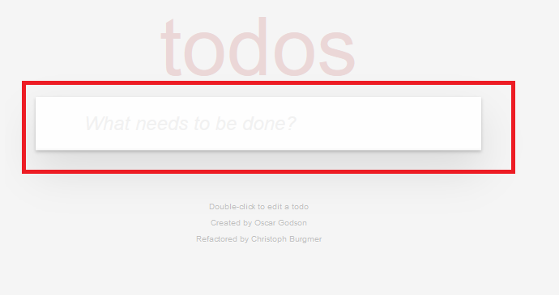
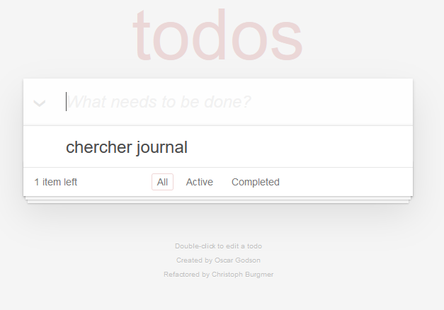
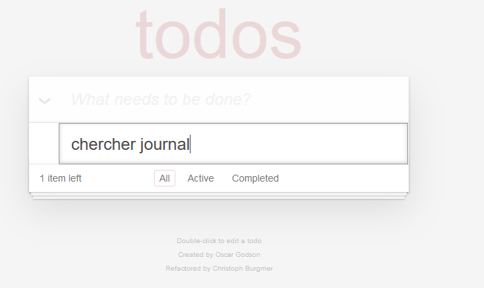
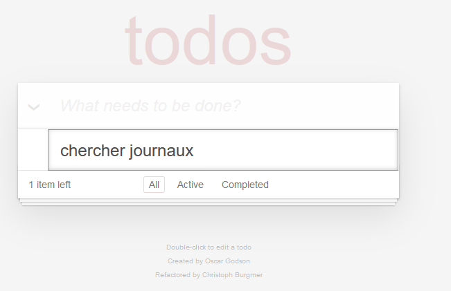
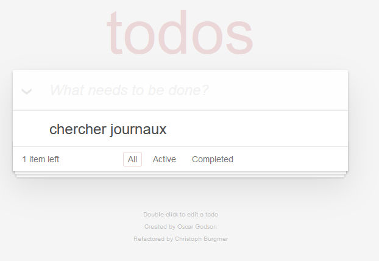
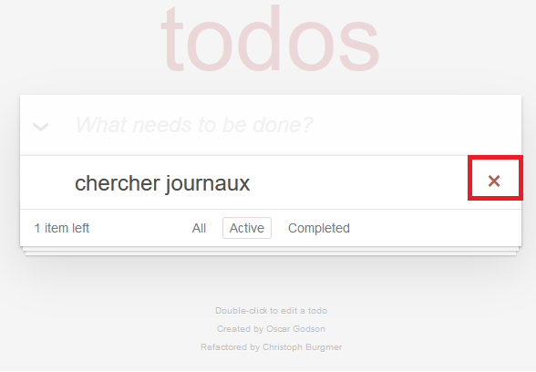
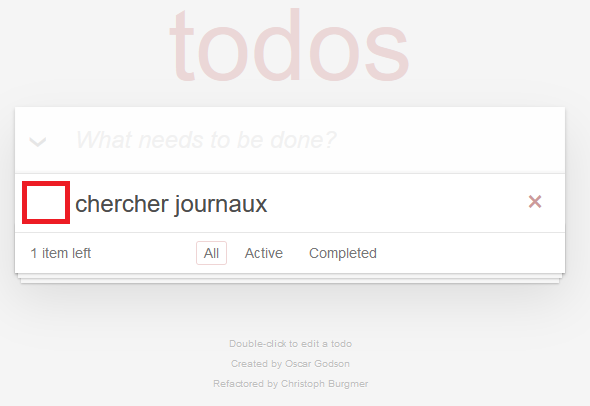
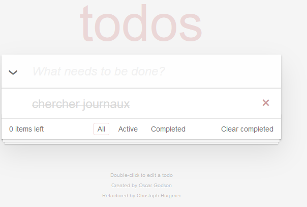

# Readme Todo List

Cette application permet de créer rapidement votre liste de tâches à faire. Elle permet d’ajouter , modifier et supprimer les tâches. L’outil de filtrage permet de voir la liste de toutes les tâches ou seulement les tâches actives ou complétés.

# Introduction

Ce document va expliquer en premier lieu la partie fonctionnelle. Ensuite ce document va expliquer installation puis la spécification technique.

# Partie fonctionnelle
Voici le interface principale de l’application. Ici, nous retrouvons un champ de saisie.

## Ajout de l’activité

Pour ajouter une activité il suffit d’écrire une activité dans le champs prévu.
Une fois terminé, taper «Entrée» pour ajouter une activité dans la liste.

La tâche viens d’être ajouter dans votre liste.

## Modification de l’activité

Pour modifier l’activité, cliquer deux fois sur le champs à modifier. Une fois cliqué, vous aller pouvoir modifier votre saisie. 

Vous pouvez maintenant modifier la saisie.

Pour confirmer le changement cliquer «Entrée». 

###Suppression de la tâche

Pour supprimer la tâche, survolez le coursor sur la partie droite de la tâche. Vous allez percevoir un croix. 
Pour supprimer la ligne cliquer sur la croix.

###Marquer une tâche comme complète

Cliquer sur la partie gauche de votre tâche pour marquer l’activité comme faite.

Une fois cliqué,la tâche va apparaître comme barrée.

