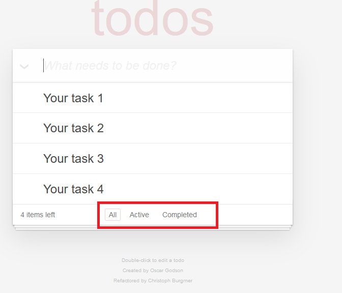

# Readme Todo List

Cette application permet de créer rapidement votre liste de tâches à faire. Elle permet d’ajouter , modifier et supprimer les tâches. L’outil de filtrage permet de voir la liste de toutes les tâches ou seulement les tâches actives ou complétés.

# Introduction

Ce document va expliquer en premier lieu la partie fonctionnelle. Ensuite ce document va expliquer installation puis la spécification technique.

# Partie fonctionnelle
Voici le interface principale de l’application. Ici, nous retrouvons un champ de saisie.

## Ajout de l’activité

Pour ajouter une activité il suffit d’écrire une activité dans le champs prévu.
Une fois terminé, taper «Entrée» pour ajouter une activité dans la liste.

La tâche viens d’être ajouter dans votre liste.

## Modification de l’activité

Pour modifier l’activité, cliquer deux fois sur le champs à modifier. Une fois cliqué, vous aller pouvoir modifier votre saisie. 

Vous pouvez maintenant modifier la saisie.

Pour confirmer le changement cliquer «Entrée». 

### Suppression de la tâche

Pour supprimer la tâche, survolez le coursor sur la partie droite de la tâche. Vous allez percevoir un croix. 
Pour supprimer la ligne cliquer sur la croix.

### Marquer une tâche comme complète

Cliquer sur la partie gauche de votre tâche pour marquer l’activité comme faite.

Une fois cliqué,la tâche va apparaître comme barrée.

### Filtrer les tâches

Vous pouvez également faire un tri parmi vos tâches avec des options suivantes :

 - All – affichage de toutes les tâches
 - Active-affichage des tâches à faire
 - Completed- les tâches terminées

#### Affichage All
Pour voir la liste des toutes tâches à faire, sélectionnez All dans le menu en bas de votre liste.

#### Affichage des tâches en cours
Sélectionnez Active dans le menu en bas de votre liste.

#### Affichage des tâches en complètes

Sélectionnez Completed dans le menu en bas de votre liste.

## Partie technique

Le code est organisé dans une architecture Model–view–controller (Modèle-vue-contrôleur ou MVC). Cela permet de bien séparer les parties front-end du code. Comme le montre le schéma, il y a trois parties. La partie Vue s’occupe de l’affichage (l’abstraction du DOM dans notre projet). La partie modèle gère les données (sous forme JSON dans notre projet). Le contrôleur fait la relation entre la vue et le modèle.

##### Schéma venant du cours Découvrez l'architecture Modèle-Vue-Contrôleur de Open Classrooms

Voici les fichiers du projet:

Ce que on appelle la vue dans ce projet c’est la classe view.js. Cette classe est une abstraction du DOM.
Model.js est la classe qui représente le Modèle. Cette classe gère les données. Les données sont stockées dans un fichier JSON. 
Le contrôleur gère la relation entre le modèle et la partie vue. Dans le projet la partie contrôleur c’est le controller.js.

### Call flow
L’écran de l’application est démarré par index.html. C’est le point d’entrée de l’application.
Il charge les fichiers CSS et Javascript.

App.js est la classe javascript qui va créer les objets MVC (model.js, view.js,controller.js). 
L’objet controller lorsque il est crée a une référence des objets model et view.
Pour chaque bouton de l’application le controller va créer les handlers de ces boutons avec la méthode bind de la classe view. Ces handlers permettent de gérer les events des boutons .
Dans les fonctions callback crées dans le contrôleur pendant l’appelle de la méthode bind, on fait des modifications du modèle et de la view.
De cette façon le controller fait les associations entre le modèle et le view. 

Voici le schéma du call flow :

En suite je vais expliquer les autres classes:

 - Store.js - Appelle une fausse base de données. Les données sont stocké sous forme JSON.
 - template.js – Permet de faire des template HTML. Cela permet de créer HTML suivant des variables.
 - helpers.js – Contient des méthodes utilitaires. Elles permettent de faciliter la manipulation de DOM. 
 

## Installation de projet

Récupérez sur le repository Github le projet ToDo list: https://github.com/MartaLC/TodoListApp.git
Téléchargez et dézippez le répertoire. 
Une fois sur votre PC faites : 
.\TodoListApp

## Lancer l’application
Aller dans le répertoire de l’application .\TodoListApp.
Ouvrez le fichier index.html dans votre navigateur.

## Lancez les tests depuis navigateur

1.Allez dans le répertoire:
TodoListApp\test
Cliquer sur SpecRunner.html

2. Vous devriez observer les tests passants en vert:

